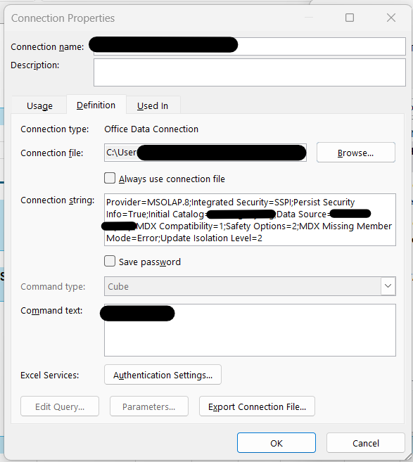

# PandOLAP: importing data from MSOLAP cubes made easy

- Author: github.com/cyrilby
- Last meaningful update: 28-08-2026

`PandOLAP` is a tiny package designed to make loading data from MSOLAP cubes into pandas data frames super easy.

The package acts as a wrapper of the `python-tabular` and `pythonnet` packages and helps to deal with annoyances such as importing seemingly missing DLLs and writing MDX queries so that the end user doesn't have to bother with them.

> [!WARNING]
> This package currently only supports Windows OS.

## Installation

To install this package into your local `venv`, add the following to your list of dependencies:

```
pandolap @ git+https://github.com/cyrilby/pandolap.git
```

The above should work regardless of whether you use a `requirements.txt` or `pyproject.toml` file.

## Connecting to your cube

In order to be able to connect to an MSOLAP cube, you need to have a local `.env` file in your project's main directory where you need to define your connection string.

### Getting your connection string 

In most cases, your connection string will look something like the following:

```
CUBE_CONN_STRING="Provider=MSOLAP.8; Integrated Security=SSPI; Persist Security Info=True; Initial Catalog=YOUR_CATALOG_NAME; Data Source=YOUR_SERVER_ADDRESS; MDX Compatibility=1; Safety Options=2; MDX Missing Member Mode=Error; Update Isolation Level=2;"
```

Make sure to replace `YOUR_CATALOG_NAME` and `YOUR_SERVER_ADDRESS` with the names of your server and your initial catalog. You can usually get these from your local IT admin or (assuming you already have a connection to the cube), you can find the connection string in Excel by going to *Data* → *Existing Connections* and then opening the properties of your cube connection:



You can then directly copy the connection string from Excel into your desired `.env` variable.

In some cases, your connection string will also contain your username and password for accessing the cube. In the example connection string above, it is assumed you have access to the cube via Windows authentication.

### Connecting to the cube via Python

After you have placed your connection string in a `.env` variable, you are ready to proceed. To establish a connection to the cube via Python, run the following commands:

```python
from pandolap import connect_to_cube

conn = connect_to_cube("CUBE_CONN_STRING")
```

## Importing data for non-MDX connoisseurs

To extract data from the cube without having to write custom MDX queries, use the `load_data_from_cube()` function. This function allows you to specify which fields you want to have in your rows and/or columns, as well as what measures you would like to use.

**Here's an example of how to use it in practice:**

```python
from pandolap import load_data_from_cube

# Specify measures, rows and columns to load via Python lists
measures = "[Number of Customers]"
rows = [
    "[Geography].[Region]",
    "[Calender].[Year and month]",
    "[Customer].[Customer type]",
    "[Customer].[Customer status]",
]
columns = None # choose this to get data in the long format
df = load_data_from_cube("CUBE_CONN_STRING", measures=measures, rows=rows, columns=columns)
```

This function will create a connection to the cube automatically, then load the specified measures and rows and return them in a `pandas` data frame format.

You may need to perform additional cleaning afterwards, e.g. if you want to ensure your column names are spelled in a more Pythonic way.

## Importing data for MDX connoisseurs

If you want to have full control over how the data is loaded, you can use the `query_cube_data()` function instead. This function allows you to have more granular control by manually writing your MDX query while still returning user-friendly output (a `pandas` data frame).

**Here's an example of how to use it in practice:**

```python
from pandolap import connect_to_cube, query_cube_data

# Make explicit connection to the cube
conn = connect_to_cube("CUBE_CONN_STRING")

# Specify measures, rows and columns to load via custom MDX
query = """
SELECT
    NON EMPTY
        { [Measures].[Number of Customers] }
    ON COLUMNS,
    NON EMPTY
        [Geography].[Region].MEMBERS
        * [Calender].[Year and month].MEMBERS
        * [Customer].[Customer type].MEMBERS
        * [Customer].[Customer status].MEMBERS
    ON ROWS
FROM [YOUR_CATALOG_NAME] -- defined in the .ENV file
"""
df = query_cube_data(conn, query)
```

The code sample above will produce the same output as the code using the `load_data_from_cube()` function, but as you can see, the process is more laborious and prone to errors for those who are not experienced with the MDX syntax.

## Other useful functions

This package also contains several other functions that can be useful, though these have more to do with extracting metadata about what information is available in the cube rather than extracting actual data.

**Here's an overview of what the remaining functions do:**

- `get_cube_datasets()`: loads a "list" of all datasets available in the specified cube
- `get_cube_hierarchies()`: loads a "list" of hierarchies available in the specified cube
- `get_cube_measures()`: loads a "list" of measures defined in the specified cube (can be used as inspiration for choosing what data to source)
- `get_cube_dimensions()`: loads a list of dimensions available in the specified cube, including top-level and bottom-level entries (can be used as inspiration for choosing what data to source)
- `get_cube_names()`: loads a "list" of the cubes available on the server specified in your connection string via the `.env` file
- `find_dll_path()`: finds the path of the DLL file that Python uses to connect to MSOLAP cubes (this function is not meant to be called by the end user and is integrated into the `connect_to_cube()` function)
- `clean_cube_column()`: adapts a single column name in a data frame sourced from a cube so that it complies with Python best practice
- `pythonize_columns()`: same as the above but applies to an entire data frame

These functions can all be directly imported from the package similar to the main functions discussed in the previous sections.

## Other things to be aware of

The underlying code uses `NON EMPTY` in order to speed the process of data extraction but can in some rare cases (depending on the exact definition of the measure you're trying to extract) underestimate the number of true missing values. Running without the `NON EMPTY` parameter will generally slow down the extraction process significantly.